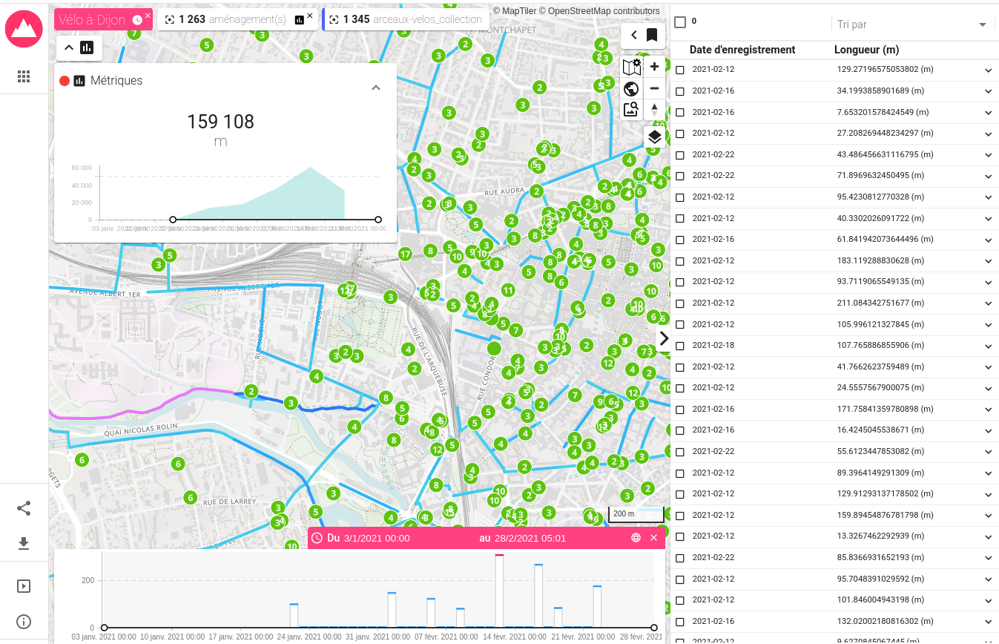

# ARLAS Exploration - Geo BigData - Vélo à Dijon

Ceci est un projet de tests de la solution de Visualisation Geo BigData **Arlas Exploration** de [Gisaïa](https://github.com/gisaia).
Consulter [cette documentation](https://docs.arlas.io/arlas-quick-start/) pour démarrer avec les exemples fournis dans le projet original.

Pour ce projet, les données chargées proviennent d'[Open Dijon](https://data.metropole-dijon.fr/pages/portal-explore/). L'objectif est de construire le tableau de bord suivant :



Dans la suite, nous allons créer :
* une composition de services elasticsearch et arlas (`server`, `hub`, `wui`, `wui-builder`, etc.)
* 2 index elasticsearch chargés avec logstash
* 2 collections arlas
* 3 tableaux de bord arlas

Dans le tableau de bord final `Vélo à Dijon !`, nous retrouverons :
* **Des couches** composant la carte :
  * les arceaux permettant d'accrocher des vélo : pastilles vertes
  * le nombre d'emplacements pour chaque arceau : compteur dans les pastilles vertes (vide pour un seul emplacement)
  * les aménagements cyclables avec une coloration interpolée en fonction de la longueur (bleu vers le rose pour les plus longs)
  * des regroupements représentant les aménagement cyclables à petite échelle : les rectangles roses (clusters)
* **Des métriques** sur la carte :
  * la longueur totale des aménagement affichés en mètres
  * une répartition dans le temps
* **Des outils** sur la carte :
  * la configuration de la carte
  * le changement de fond cartographique
  * un requêteur géographique simple (ex : intersection avec un polygone dessiné)
  * d'autres outils de positionnement ou de gestion des couches
* **Un tableau de données** sur la droite, synchronisé avec les aménagements affichés sur la carte
* **Une timeline** sous la carte avec les dates d'aménagements et la possibilité de filtrer sur une période

La suite décrit une manière d'arriver à ce résultat. Les fichiers `nginx.conf`, `env.sh`, `start.sh` et `stop.sh` proviennent du projet [ARLAS-Exploration-stack](https://github.com/gisaia/ARLAS-Exploration-stack.git), le fichier `docker-compose.yml` en est inspiré et le reste est spécifique au jeu de données.

Prérequis :
* docker

## Démarrer Arlas et ses dépendances

À la racine du projet, créer et adapter le fichier `.env`. Ici, il s'agit des dernières versions au 22/12/2023 si bien qu'on aurait pu utiliser les tags `latest` :
```sh
cp .env.example .env
```

Démarrer le serveur :
```sh
bash ./start.sh
```

Les URLs exposées sont affichées dans le terminal. On retiendra http://localhost:81/hub/ comme point d'entrée.

## Récupérer les dernières données (facultatif)

Deux jeux de données de https://data.metropole-dijon.fr/pages/portal-explore/ sont exploités :
* `Aménagements cyclables`
* `Arceaux vélos`

Les fichiers ont été récupérés et versionnés le 22/12/2023. Pour obtenir la dernière version :
```sh
# Aménagements cyclables
curl -L -o data.metropole-dijon.fr/amenagements-cyclables/data.csv "https://data.metropole-dijon.fr/api/explore/v2.1/catalog/datasets/amenagements-cyclables/exports/csv?lang=fr&timezone=Europe%2FBerlin&use_labels=true&delimiter=%3B"

# Arceaux
curl -L -o data.metropole-dijon.fr/arceaux-velos/data.csv "https://data.metropole-dijon.fr/api/explore/v2.1/catalog/datasets/arceaux-velos/exports/csv?lang=fr&timezone=Europe%2FBerlin&use_labels=true&delimiter=%3B"
```

## Indexer les données et créer les visualisations
### Définition des fonctions utilitaires

Exécuter les commandes suivantes, qui définissent les fonctions :
```sh
# ----------------------------------------
# -1- Index Elasticsearch
# ----------------------------------------

createElasticIndex() {
    local DATASET_BASE_PATH="$1"
    local DATASET_BASE_NAME="$2"

    echo && echo && echo && echo ">> Suppression préventive de l'index"
    curl -X DELETE "http://localhost:9200/${DATASET_BASE_NAME}_index"

    echo && echo && echo ">> Création de l'index avec le mapping adéquat"
    curl -XPUT "http://localhost:9200/${DATASET_BASE_NAME}_index/?pretty" \
        --upload-file ${DATASET_BASE_PATH}/es_mapping.json \
        -H 'Content-Type: application/json'

    echo && echo && echo ">> Alimentation de l'index"
    network=$(docker network ls --format "table {{.Name}}" | grep arlas)
    cat ${DATASET_BASE_PATH}/data.csv | docker run -e XPACK_MONITORING_ENABLED=false \
        --net ${network} \
        --env ELASTICSEARCH=elasticsearch:9200  \
        --env INDEXNAME=${DATASET_BASE_NAME}_index --rm -i \
        -v ${PWD}/${DATASET_BASE_PATH}/2es.logstash.conf:/usr/share/logstash/pipeline/logstash.conf docker.elastic.co/logstash/logstash:8.7.0
}

checkElasticIndex() {
    local DATASET_BASE_NAME="$1"

    echo && echo && echo && echo "?? Index, premières entrées :"
    curl  -H 'Content-Type: application/json' -X GET "http://localhost:9200/${DATASET_BASE_NAME}_index/_search?size=2&pretty"

    echo && echo && echo "?? Index, mapping :"
    curl  -H 'Content-Type: application/json' -X GET "http://localhost:9200/${DATASET_BASE_NAME}_index/?pretty"

    echo && echo && echo "?? Index, nombre d'entrées :"
    curl -XGET "http://localhost:9200/${DATASET_BASE_NAME}_index/_count?pretty"
}

# ----------------------------------------
# -2- Collection ARLAS
# ----------------------------------------

createArlasCollection() {
    local DATASET_BASE_PATH="$1"
    local DATASET_BASE_NAME="$2"

    echo && echo && echo && echo ">> Suppression collection Arlas"
    curl -X DELETE "http://localhost:81/server/collections/${DATASET_BASE_NAME}_collection"

    echo && echo && echo ">> Création collection Arlas"
    curl -X PUT \
        --header 'Content-Type: application/json;charset=utf-8' \
        --header 'Accept: application/json' \
        "http://localhost:81/server/collections/${DATASET_BASE_NAME}_collection?pretty=true" \
        --upload-file ${DATASET_BASE_PATH}/collection.json
}

checkArlasCollection() {
    local DATASET_BASE_NAME="$1"
    echo && echo && echo && echo "?? Collection Arlas :"
    curl -X GET "http://localhost:81/server/collections/${DATASET_BASE_NAME}_collection?pretty=true"
}
```

### Aménagements cyclables

```sh
DATASET_BASE_PATH=data.metropole-dijon.fr/amenagements-cyclables
DATASET_BASE_NAME=amenagements-cyclables

# Go !
createElasticIndex ${DATASET_BASE_PATH} ${DATASET_BASE_NAME} \
  && createArlasCollection ${DATASET_BASE_PATH} ${DATASET_BASE_NAME}

# Check :)
checkElasticIndex ${DATASET_BASE_NAME} \
  && checkArlasCollection ${DATASET_BASE_NAME}
```

Importer le tableau de bord (opération manuelle) :
* http://localhost:81/builder/load/import
* Charger config.json : choisir `data.metropole-dijon.fr/amenagements-cyclables/collection.json`
* Charger config.map.json : choisir `data.metropole-dijon.fr/amenagements-cyclables/collection.map.json`
* Créer > Sauvegarder > `Aménagements cyclables`

Puis l'ouvrir :
* http://localhost:81/wui

### Arceaux vélos

```sh
DATASET_BASE_PATH=data.metropole-dijon.fr/arceaux-velos
DATASET_BASE_NAME=arceaux-velos

# Go !
createElasticIndex ${DATASET_BASE_PATH} ${DATASET_BASE_NAME} \
  && createArlasCollection ${DATASET_BASE_PATH} ${DATASET_BASE_NAME}

# Check :)
checkElasticIndex ${DATASET_BASE_NAME} \
  && checkArlasCollection ${DATASET_BASE_NAME}
```

Importer le tableau de bord (opération manuelle) :
* http://localhost:81/builder/load/import
* Charger config.json : choisir `data.metropole-dijon.fr/arceaux-velos/config.json`
* Charger config.map.json : choisir `data.metropole-dijon.fr/arceaux-velos/config.map.json`
* Créer > Sauvegarder > `Arceaux vélos`

Puis l'ouvrir :
* http://localhost:81/wui

### Tableau de bord général (pistes aménagées et arceaux)

Importer le tableau de bord (opération manuelle) :
* http://localhost:81/builder/load/import
* Charger config.json : choisir `data.metropole-dijon.fr/aménagements.config.json`
* Charger config.map.json : choisir `data.metropole-dijon.fr/aménagements.config.map.json`
* Créer > Sauvegarder > `Vélo à Dijon !`

Puis l'ouvrir :
* http://localhost:81/wui

## Nettoyage

```sh
# Conteneurs : le script stop.sh les arrête et les supprime
./stop.sh

# Données
sudo rm -rf .arlas
docker volume rm arlas-exploration-stack_esdata1

# Images
docker rmi $(docker images | awk '{ OFS = ":" }$1 ~ /gisaia\/arlas-/ {print $1,$2}')
```
